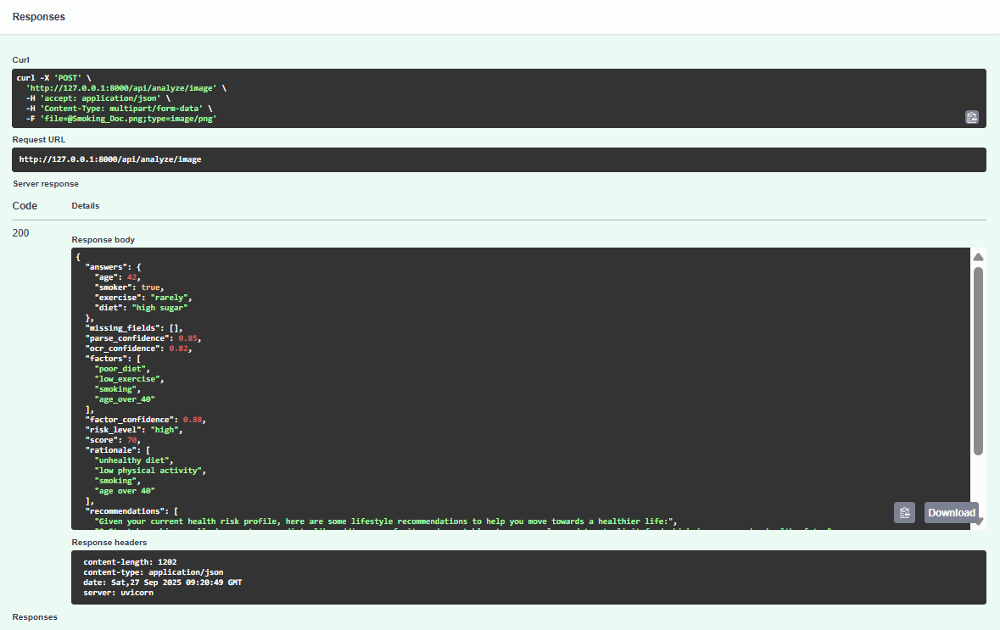
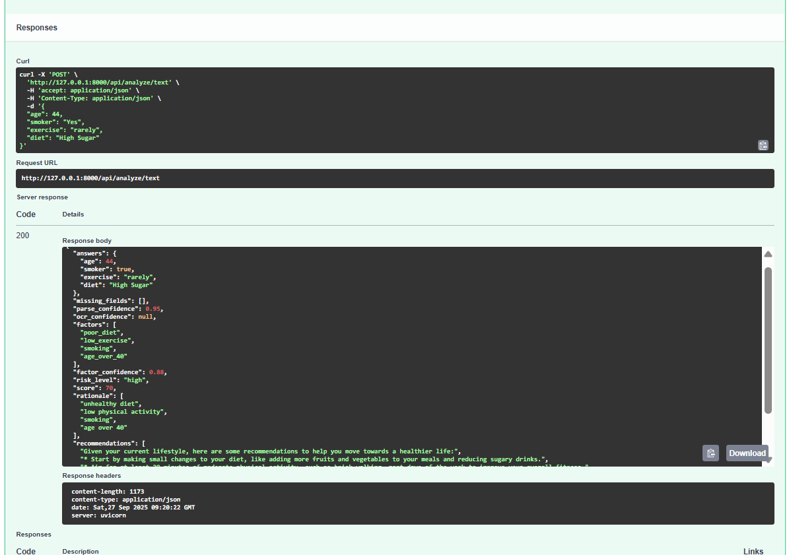

# AI Health Risk Profiler

An **AI-powered Health Risk Profiler** that analyzes lifestyle survey responses (typed or scanned forms) and generates a structured health risk profile. It handles noisy inputs, missing answers, and provides actionable, non-diagnostic recommendations.

---

## Features

- Accepts lifestyle survey data via text input or scanned forms (image upload).  
- Handles incomplete or noisy survey data gracefully.  
- Uses AI to classify health risk levels (low, medium, high).  
- Generates structured recommendations for healthier living.  
- Easy integration via REST API.  

---

## Technologies Used

- Python 3.10+  
- FastAPI (for backend API)  
- Pydantic (data validation)  
- OCR: Tesseract / EasyOCR (for scanned forms)  
- GROQ API - Recommendation Engine
- Rule Based Risk calculator and Parser .

---

## Installation

1. Clone the repository:
```bash
git clone https://github.com/yourusername/ai-health-risk-profiler.git
cd ai-health-risk-profiler
```

2. Create a virtual environment:
```bash
python -m venv venv
source venv/bin/activate  # Linux / Mac
venv\Scripts\activate     # Windows
```

3. Install dependencies:
```bash
pip install -r requirements.txt
```

---

## Configuration

1. Create a `.env` file in the root directory.  
2. Add your API key for AI service I have used GROK API in case of other api key change code as per required:

```env
GROQ_API_KEY=your_api_key_here
```

3. (Optional) Configure OCR settings if using scanned forms:
```env
OCR_LANG=eng
```

---

## Usage

### Start the API Server
```bash
uvicorn main:app --reload
```

### API Endpoints

**1. `/analyze-text`**  
- Method: POST  
- Description: Analyze health risk from text survey.  
- Body Example:
```json
{
  "user_id": "12345",
  "survey_text": "I smoke occasionally, exercise rarely, and eat fast food frequently."
}
```
- Response Example:
```json
{
  "risk_level": "high",
  "factors": ["smoking", "poor_diet", "low_exercise"],
  "recommendations": [
    "Start by adding 30 mins of exercise daily",
    "Reduce processed food intake",
    "Consider quitting smoking"
  ]
}
```

**2. `/analyze-image`**  
- Method: POST  
- Description: Analyze health risk from uploaded survey form image.  
- Form-data Key: `file` (image file)  
- Response: Same as `/analyze-text`  

---

## Project Structure

```
Health-Risk-Profiler/
│
├── app/
│   ├── routes/
│   │   └── analyze.py       # API endpoints for text and image analysis
│   ├── services/
│   │   ├── parser.py        # Parses text/JSON survey responses
│   │   ├── ocr_service.py   # Converts images to text using Tesseract
│   │   ├── risk_engine.py   # Extracts risk factors and calculates risk score
│   │   └── recommender.py   # Generates AI-driven recommendations
│   ├── utils/
│   │   └── helpers.py       # Helper functions like guardrail checks
│   └── schemas.py           # Pydantic models for request/response validation
│
├── main.py                  # FastAPI app entry point
├── requirements.txt         # Project dependencies
└── .gitignore               # Excludes venv, .env, etc.

```

### Output Looks like : 




## Notes

- This tool provides **informational health risk insights** only and is **not a diagnostic tool**.  
- Ensure API keys are kept secure and **do not commit `.env`** to public repos.  
- Works best with clear survey inputs; OCR may misread very noisy or handwritten forms.  

---

## License

MIT License.  

---

## Contact

For issues or contributions, contact: [alash0849@gmail.com]  

